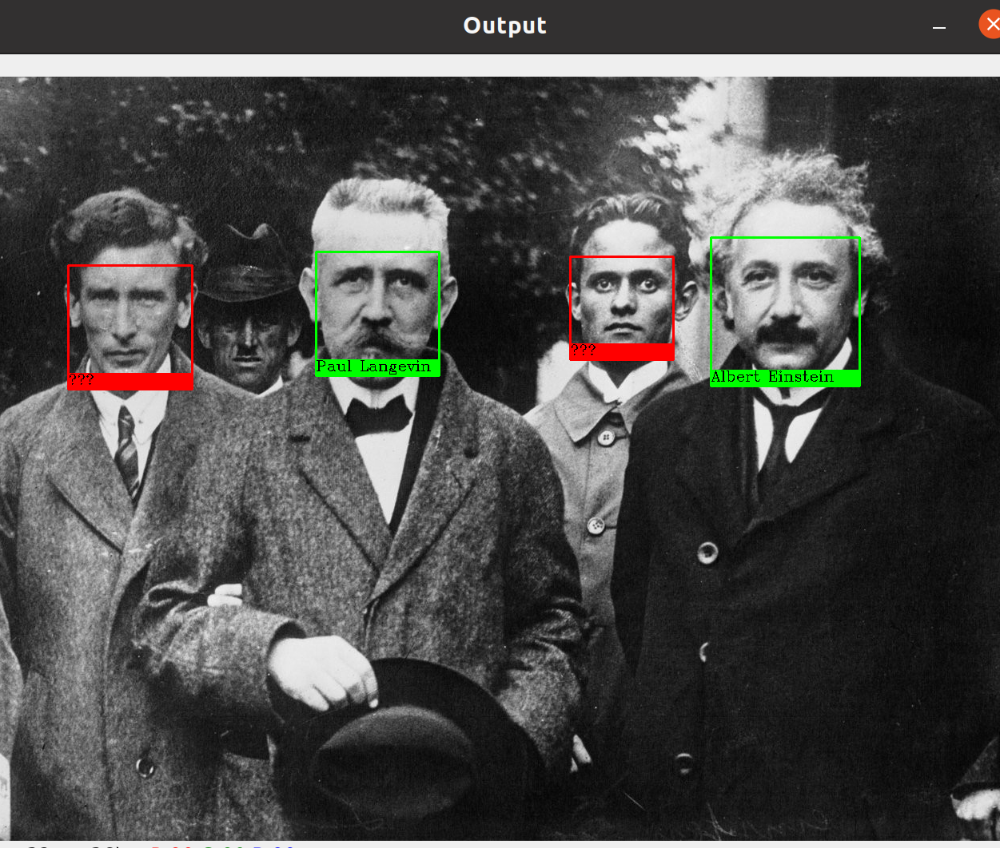

# Reconocimiento de caras

1. [Cargamos las imagenes con los rostros que queremos identificar](#schema1)
2. [El siguiente paso es extraer los 'encodings' de cada imagen.](#schema2)
3. [Creamos un array con los encodings y otro con sus respectivos nombres](#schema3)
4. [Cargamos una fuente de texto y la imagen ](#schema4)
5. [Definir tres arrays, que servirán para guardar los parámetros de los rostros que se encuentren en la imagen](#schema5)
6. [Localizamos cada rostro de la imagen y extraemos sus encodings](#schema6)
7. [Recorremos el array de encodings que hemos encontrado](#schema7)
8. [Dibujamos un recuadro rojo alrededor de los rostros desconocidos, y uno verde alrededor de los conocidos](#schema8)
9. [Abrimos una ventana con el resultado](#schema9)
10. [Enlaces](#schema10)

# 1. Cargamos las imagenes con los rostros que queremos identificar
~~~python
imagen_einstein = face_recognition.load_image_file("einstein.jpg")
imagen_paul = face_recognition.load_image_file("paul.jpg")
imagen_planck = face_recognition.load_image_file("planck.jpg")
~~~

# 2. El siguiente paso es extraer los 'encodings' de cada imagen.
Los encodings son las características únicas de cada rostro que permiten diferenciarlo de otros.
~~~python
einstein_encodings = face_recognition.face_encodings(imagen_einstein)[0]
paul_encodings = face_recognition.face_encodings(imagen_paul)[0]
planck_encodings = face_recognition.face_encodings(imagen_planck)[0]
~~~

# 3. Creamos un array con los encodings y otro con sus respectivos nombres

~~~python
encodings_conocidos = [einstein_encodings,paul_encodings,planck_encodings]
nombres_conocidos = ["Albert Einstein","Paul Langevin","Max Planck"]
~~~

 
# 4. Cargamos una fuente de texto y la imagen 
~~~python
font = cv2.FONT_HERSHEY_COMPLEX
img = face_recognition.load_image_file('imagen_input2.jpg')
~~~

 
# 5. Definir tres arrays, que servirán para guardar los parámetros de los rostros que se encuentren en la imagen
~~~python
loc_rostros = [] #Localizacion de los rostros en la imagen 
encodings_rostros = [] #Encodings de los rostros
nombres_rostros = [] #Nombre de la persona de cada rostro
~~~

# 6. Localizamos cada rostro de la imagen y extraemos sus encodings
~~~python
loc_rostros = face_recognition.face_locations(img)
encodings_rostros = face_recognition.face_encodings(img, loc_rostros)
~~~

# 7. Recorremos el array de encodings que hemos encontrado
~~~python
for encoding in encodings_rostros:
 
    #Buscamos si hay alguna coincidencia con algún encoding conocido:
    coincidencias = face_recognition.compare_faces(encodings_conocidos, encoding)
 
    #El array 'coincidencias' es ahora un array de booleanos.
    #Si contiene algun 'True', es que ha habido alguna coincidencia:
    if True in coincidencias:
        #Buscamos el nombre correspondiente en el array de nombres conocidos:
        nombre = nombres_conocidos[coincidencias.index(True)]
 
    #Si no hay ningún 'True' en el array 'coincidencias', no se ha podido identificar el rostro:
    else:
        nombre = "???"
 
    #Añadimos el nombre de la persona identificada en el array de nombres:
    nombres_rostros.append(nombre)
~~~

# 8. Dibujamos un recuadro rojo alrededor de los rostros desconocidos, y uno verde alrededor de los conocidos
~~~python
for (top, right, bottom, left), nombre in zip(loc_rostros, nombres_rostros):
 
    #Cambiar el color segun el nombre:
    if nombre != "???":
        color = (0,255,0) #Verde
    else:
        color = (0,0,255) #Rojo
 
    #Dibujar los recuadros alrededor del rostro:
    cv2.rectangle(img, (left, top), (right, bottom), color, 2)
    cv2.rectangle(img, (left, bottom - 20), (right, bottom), color, -1)
 
    #Escribir el nombre de la persona:
    cv2.putText(img, nombre, (left, bottom - 6), font, 0.6, (0,0,0), 1)
~~~

# 9. Abrimos una ventana con el resultado
~~~python
cv2.imshow('Output', img)
print("\nMostrando resultado. Pulsa cualquier tecla para salir.\n")
cv2.waitKey(0)
cv2.destroyAllWindows()
~~~

# 10. Enlaces usados
https://robologs.net/2020/05/05/deteccion-y-reconocimiento-facial-con-opencv-python-y-facerecognition/
